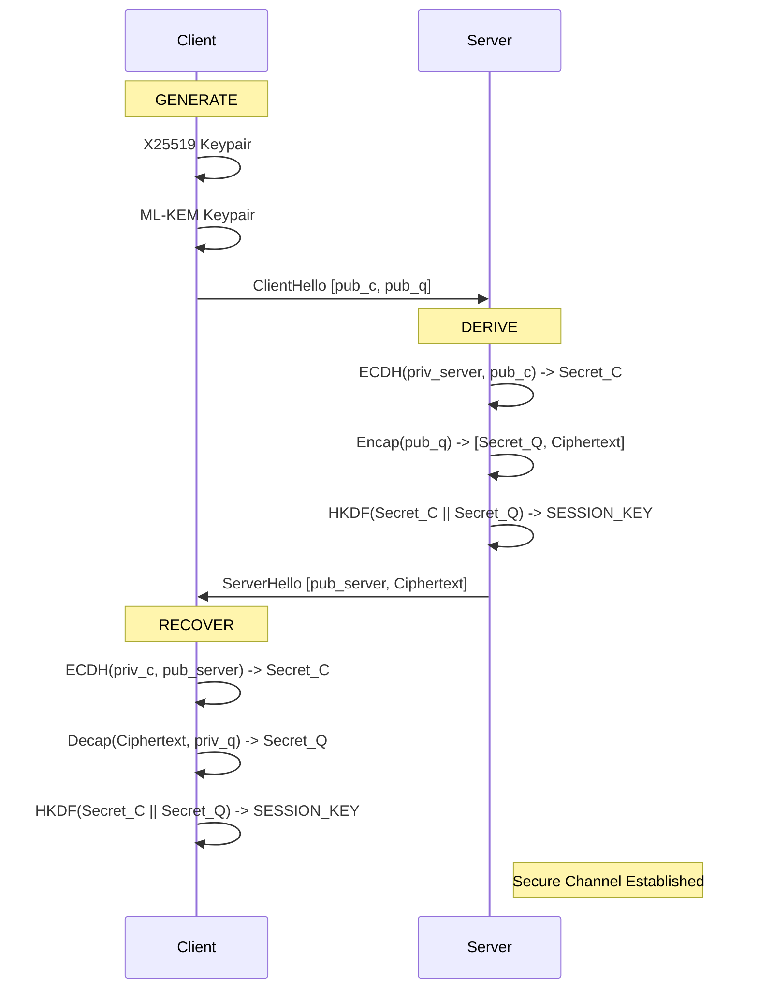
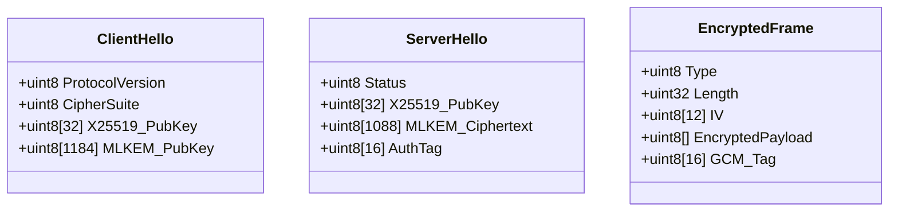
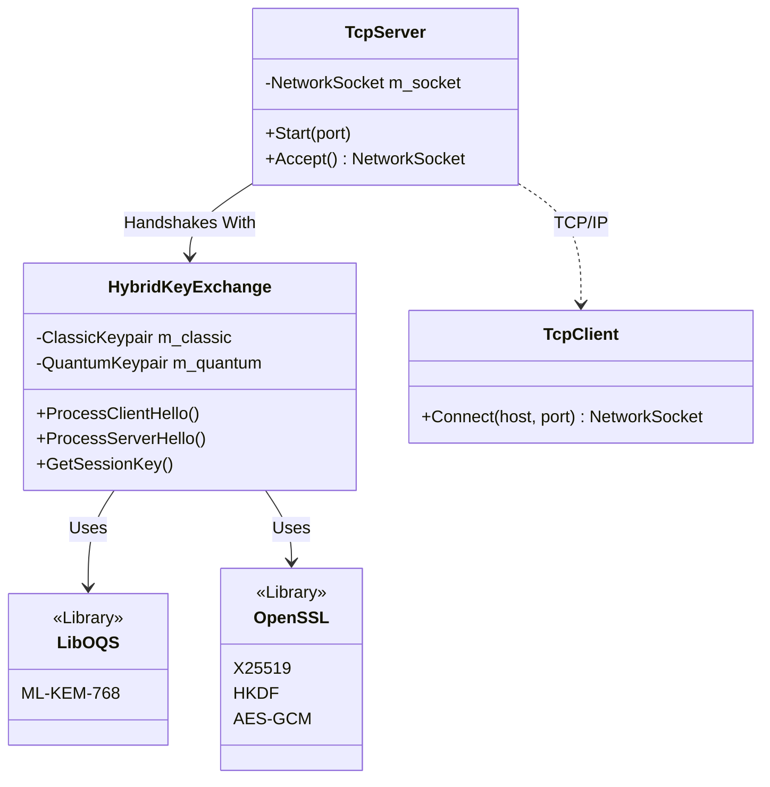

# Technical Architecture: Quantum-Shield 6G

**Status**: Prototype / Active Development
**Context**: Next-Gen Network Security (Post-Quantum Cryptography)

---

## 1. Executive Summary

**Quantum-Shield 6G** is a secure communication prototype designed to mitigate the **Harvest Now, Decrypt Later** threat. Adversaries storing encrypted traffic today could retroactively decrypt it using future quantum computers.

To prevent this, the system implements a **Hybrid Key Exchange (HKE)** that layers two distinct cryptographic primitives:
1.  **Classic Layer (ECC X25519)**: Elliptic Curve Diffie-Hellman. Fast, mature, and secure against all known conventional attacks.
2.  **Quantum Layer (ML-KEM-768)**: A lattice-based mechanisms (formerly Kyber). Specifically designed to resist Shor’s algorithm, which powers quantum attacks.

Security is achieved through the "weakest link" principle: breaking the session key requires breaking *both* the elliptic curve discrete logarithm problem AND the lattice learning-with-errors problem.

---

## 2. Cryptographic Concepts

The system relies on two fundamentally different mathematical problems.

### The Classic Layer: Elliptic Curve Cryptography (X25519)
*   **The Mechanism**: Uses points on the Curve25519 structure.
*   **The Math**: Relies on the **Discrete Logarithm Problem**. Given a starting point $G$ and an endpoint $P = nG$, it is computationally infeasible for classical computers to determine the scalar $n$ (the private key).
*   **The Quantum Threat**: Quantum computers using **Shor’s Algorithm** can solve this problem efficiently by finding the period of the function, effectively recovering the private key in polynomial time.

### The Quantum Layer: Lattice-Based Cryptography (ML-KEM)
*   **The Mechanism**: Uses high-dimensional geometric structures called lattices.
*   **The Math**: Relies on the **Learning With Errors (LWE)** problem/Module-LWE.
    *   Think of this as solving a system of linear equations, but with small, random "noise" added to the solution.
    *   While simple linear algebra is easy to solve, the added noise makes recovering the exact solution computationally exhaustive, even for quantum computers.
*   **Why It Works**: There is currently no known quantum algorithm that can efficiently "denoise" or find the short vector in these high-dimensional lattices.

---

## 3. The Protocol: "Life of a Connection"

The system implements a specific handshake flow to establish a shared `Session_Key`.

### Phase 1: Key Generation (Setup)
The **Client** generates ephemeral keypairs for both algorithms:
1.  **X25519**: `priv_c` (32 bytes), `pub_c` (32 bytes).
2.  **ML-KEM-768**: `priv_q` (2400 bytes), `pub_q` (1184 bytes).
3.  **ClientHello**: Sent to Server containing `[pub_c, pub_q]`.

### Phase 2: Encapsulation (Server)
The **Server** accepts the `ClientHello` and performs the core hybrid logic:
1.  **Classic Agreement**: Generates its own ephemeral X25519 keypair and computes the **Classic Shared Secret** using ECDH.
2.  **Quantum Encapsulation**: Uses the Client’s `pub_q` to run `crypto_kem_encap`.
    *   Generates the **Quantum Shared Secret** (32 bytes).
    *   Produces the **Ciphertext** (1088 bytes) needed by the client to recover that secret.
3.  **Key Derivation**: Both secrets are fed into **HKDF-SHA256**.
    $$ K_{session} = \text{HKDF}(\text{salt}, S_{classic} || S_{quantum}) $$
4.  **ServerHello**: Sent to Client containing `[Server_pub_c, Ciphertext]`.

### Phase 3: Decapsulation (Client)
The **Client** receives the response:
1.  **Classic Agreement**: Computes the **Classic Shared Secret** using its `priv_c` and the Server's `pub_c`.
2.  **Quantum Decapsulation**: Uses its `priv_q` and the received `Ciphertext` to run `crypto_kem_decap` and recover the **Quantum Shared Secret**.
3.  **Key Derivation**: Runs the exact same HKDF function to derive the matching `Session_Key`.

### Visual Flow



### Data Packet Structure (Binary Protocol)

This diagram visualizes the actual data layout of the handshake messages on the wire.



---

## 4. Technology Stack

| Component | Technology | Rationale |
|-----------|------------|-----------|
| **Implementation** | **C++20** | Selected for deterministic memory management (RAII) and zero-cost abstractions (`std::span`). Avoids GC pauses and provides direct memory control critical for crypto. |
| **Classic Algo** | **OpenSSL 3.0** | Industry standard for X25519. Provides optimized, constant-time assembly implementations to resist side-channel attacks. |
| **Quantum Algo** | **liboqs** | The standard C library for NIST PQC algorithms. We specifically use the **ML-KEM-768** parameter set (security equivalent to AES-192/SHA-384). |
| **Validation** | **Google Test** | Automated test suite verifying both positive handshake completion and negative security cases (e.g., implicit rejection of tampered ciphertext). |

### System Architecture



---

## 5. Networking Architecture

The system uses a custom binary protocol directly over TCP, avoiding the overhead and complexity of HTTP/TLS for this specific prototype.

### Design Principles (RAII & Blocking I/O)
*   **Safety First**: We use a `NetworkSocket` wrapper class that follows RAII (Resource Acquisition Is Initialization). When a socket object goes out of scope, its destructor automatically closes the file descriptor. This prevents resource leaks, a common issue in C network programming.
*   **Blocking Architecture**: For simplicity and determinism, we use blocking I/O. The `TcpServer` waits for a client, and `Accept()` blocks until a connection arrives. This is appropriate for high-security, point-to-point links where latency determinism is more critical than handling 10,000 concurrent C10K connections.
*   **Cross-Platform**: The codebase uses preprocessor directives (`#ifdef _WIN32`) to handle the subtle differences between Windows Winsock and Linux POSIX sockets, allowing the same C++ code to compile in our Docker container (Linux) and on a developer's Windows machine.

### Wire Protocol Specification
The binary protocol is minimal and explicitly defined to prevent parsing ambiguities.

**Header Format (Fixed 5 Bytes)**
All messages start with this header in Network Byte Order (Big Endian):
1.  **Type (1 Byte)**: Identifies the message (`0x01` ClientHello, `0x02` ServerHello, etc.).
2.  **Length (4 Bytes)**: Unsigned integer specifying the payload size.

**Why Network Byte Order?**
x86 processors are Little Endian. Network protocols require Big Endian. We explicitly use `htonl()` (Host-to-Network Long) and `ntohl()` to flip the bytes before sending/receiving. This ensures a Linux server can talk to an ARM client or Windows machine without corruption.

---

## 6. Secure Transport Layer (Authenticated Encryption)

Once the `HybridKeyExchange` has successfully derived a shared session key, the system transitions into a secure transport mode managed by the `SecureSession` class.

### Architecture: The `SecureSession` Wrapper
The `SecureSession` object takes ownership of a connected `NetworkSocket` and a `HybridKeyExchange` instance. It acts as a secure tunnel:
*   **Handshake Orchestrator**: It drives the state machine (Client sends Hello -> Server responds -> Keys derived).
*   **Encryption Gateway**: Application data passed to `SendEncrypted()` is transparently encrypted before hitting the wire.

### Encryption Standard: AES-256-GCM
We use **AES-256-GCM** (Galois/Counter Mode) for all application data.
*   **Confidentiality**: Uses the 256-bit `Session_Key` derived from the hybrid KEM.
*   **Integrity & Authentication**: GCM provides an authentication tag. If an attacker modifies the ciphertext, the decryption function in OpenSSL (`EVP_DecryptFinal_ex`) will fail, and we immediately drop the packet.
*   **IV Strategy**: For this prototype, we generate a **random 12-byte IV** for every message. This IV is prepended to the ciphertext. (Note: A production version might use a deterministic counter-based IV to prevent replay attacks more efficiently).

### Encrypted Frame Structure
When valid data is sent, the wire format changes to `MsgType::SECURE_PAYLOAD`. The payload contains:

1.  **IV (12 Bytes)**: Random Initialization Vector.
2.  **Ciphertext (Variable)**: The encrypted application data.
3.  **Auth Tag (16 Bytes)**: GCM Integrity Tag.

```
[ Header (5B) ] [ IV (12B) ] [ ........ Ciphertext ........ ] [ Tag (16B) ]
^ Type=0x03     ^ Public     ^ Encrypted                     ^ Integrity
```

---

## 7. Verification Strategy

We validate the system through strict unit testing in a controlled Docker environment.

*   **Correctness**: Automated tests confirm that Client and Server independently derive the exact same 32-byte session key.
*   **Security (Implicit Rejection)**: Tests verify that if the Quantum Ciphertext is modified in transit (even by a single bit), the KEM decapsulation succeeds but produces a *different, random* shared secret. This causes the final derived session keys to mismatch, ensuring the connection fails securely without revealing specific error information to the attacker.
